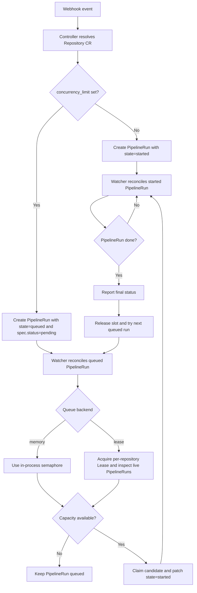

This page illustrates how Pipelines-as-Code manages concurrent PipelineRun execution. When you set a concurrency limit on a Repository CR, Pipelines-as-Code queues incoming PipelineRuns and starts them only when capacity allows.

The watcher supports two queue backends controlled by the global `concurrency-backend` setting in the `pipelines-as-code` ConfigMap:

- `memory` keeps queue state in the watcher process. This is the historical behavior and remains the default.
- `lease` stores queue coordination in Kubernetes using `Lease` objects and short-lived PipelineRun claims. This mode is more resilient when the watcher restarts or the cluster is slow to reconcile updates.



## Flow diagram



## Backend selection

To enable the Kubernetes-backed queue coordination, set the global config to:

```yaml
data:
  concurrency-backend: "lease"
```

Restart the watcher after changing `concurrency-backend`; the backend is selected at startup.

When `lease` mode is enabled, Pipelines-as-Code still uses the existing `queued`, `started`, and `completed` PipelineRun states. The difference is that promotion of the next queued PipelineRun is serialized with a per-repository `Lease`, which reduces queue drift during cluster/API instability.

## How lease promotion works

When the watcher reconciles a queued PipelineRun under the `lease` backend, it follows this sequence:

1. Acquire the per-repository Kubernetes Lease (retry up to 20 times with 100 ms delay).
2. List live PipelineRuns for that repository.
3. Separate them into running, claimed, and claimable queued runs.
4. Compute available capacity: `concurrency_limit - running - claimed`.
5. Patch one or more queued runs with short-lived claim annotations (`queue-claimed-by`, `queue-claimed-at`).
6. Release the repository Lease.
7. Re-fetch the claimed run and patch it to `started`.

If promotion fails at step 7, the watcher records the failure on the PipelineRun, clears the claim, and another reconcile retries later.

Claims expire after **30 seconds**. If a watcher crashes or stalls before completing promotion, another instance can pick up the run once the claim expires.

## Recovery loop

When the `lease` backend is active, the watcher starts a background recovery loop that runs every **31 seconds** (claim TTL + 1 s buffer). It looks for repositories where:

- there is no started PipelineRun
- there is no queued PipelineRun with an active (unexpired) claim
- there is still at least one recoverable queued PipelineRun

A queued PipelineRun is recoverable when it has `state=queued`, `spec.status=Pending`, is not done or cancelled, and has a valid `execution-order` annotation.

When a candidate is found, the recovery loop clears stale debug annotations and re-enqueues the oldest recoverable run so normal promotion logic runs again.

## Debugging the Lease Backend

When `concurrency-backend: "lease"` is enabled, queued `PipelineRun`s expose queue debugging state directly in annotations:

- `pipelinesascode.tekton.dev/queue-decision`
- `pipelinesascode.tekton.dev/queue-debug-summary`
- `pipelinesascode.tekton.dev/queue-claimed-by`
- `pipelinesascode.tekton.dev/queue-claimed-at`
- `pipelinesascode.tekton.dev/queue-promotion-retries`
- `pipelinesascode.tekton.dev/queue-promotion-last-error`

This makes it possible to diagnose most queue issues with `kubectl` before looking at watcher logs.

### Useful commands

```bash
kubectl get pipelinerun -n <namespace> <name> -o jsonpath='{.metadata.annotations.pipelinesascode\.tekton\.dev/queue-decision}{"\n"}'
kubectl get pipelinerun -n <namespace> <name> -o jsonpath='{.metadata.annotations.pipelinesascode\.tekton\.dev/queue-debug-summary}{"\n"}'
kubectl describe pipelinerun -n <namespace> <name>
kubectl get events -n <namespace> --field-selector involvedObject.kind=Repository
```

### Queue decisions

- `waiting_for_slot`: the run is queued and waiting for repository capacity.
- `claim_active`: another watcher already holds an active short-lived claim on this run.
- `claimed_for_promotion`: this run has been claimed and is being promoted to `started`.
- `promotion_failed`: the watcher failed while promoting the run to `started`.
- `recovery_requeued`: the lease recovery loop noticed this run and enqueued it again.
- `missing_execution_order`: the run is queued but its execution order annotation does not include itself.
- `not_recoverable`: the run is still `queued` but is no longer eligible for lease recovery.

### Events

The watcher also emits repository-scoped Kubernetes events for the most important transitions:

- `QueueClaimedForPromotion`
- `QueuePromotionFailed`
- `QueueRecoveryRequeued`
- `QueueLeaseAcquireTimeout`

### Troubleshooting

| Symptom | Queue decision | Likely cause | Action |
| --- | --- | --- | --- |
| Run stuck queued, nothing running | `waiting_for_slot` | Completed run was not cleaned up or finalizer is stuck | Check if a `started` PipelineRun still exists for the repo. If it is done but state was not updated, delete it or patch its state to `completed`. |
| Run stuck queued, another run is running | `waiting_for_slot` | Normal — the run is waiting for the active run to finish. | No action needed unless the running PipelineRun is itself stuck. |
| Run keeps cycling between queued and claimed | `claim_active` | Two watcher replicas are contending for the same run. | Wait for the claim to expire (30 s). If it persists, check watcher logs for lease acquisition errors. |
| Run shows promotion failures | `promotion_failed` | The watcher failed to patch the run to `started` (API error, webhook, or admission rejection). | Check `queue-promotion-last-error` and `queue-promotion-retries` annotations. Resolve the underlying API or admission error. |
| Run was recovered but is stuck again | `recovery_requeued` | The recovery loop re-enqueued the run but promotion failed again on the next attempt. | Check for repeated `QueuePromotionFailed` events on the repository. The underlying issue (permissions, resource quota, webhook) must be fixed. |
| Run is queued but marked not recoverable | `not_recoverable` | The run was cancelled, completed, or lost its `execution-order` annotation. | Inspect the PipelineRun — if it should still run, re-apply the `execution-order` annotation manually. |

If the queue decision and events do not explain the behavior, switch the watcher to debug logging and grep for the repository key and PipelineRun key. The lease backend logs include lease acquisition attempts, active claim evaluation, queue-state snapshots, and recovery loop selections.
