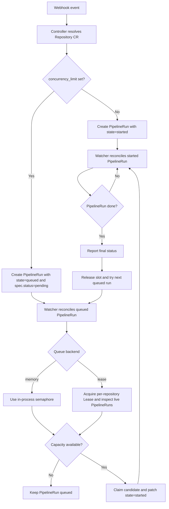

Use `spec.concurrency_limit` on a Repository CR to cap how many `PipelineRun`s may run at once for that repository.
This is useful when you need to control cluster usage, preserve ordering for related runs, or avoid a burst of webhook events starting too many `PipelineRun`s at once.

## Repository setting

Set the `concurrency_limit` field on the Repository CR:

```yaml
spec:
  concurrency_limit: <number>
```

When a webhook event produces multiple `PipelineRun`s for the same repository:

- the controller creates them with an `execution-order` annotation
- runs that cannot start immediately are created as `state=queued` with Tekton `spec.status=pending`
- the watcher promotes queued runs to `state=started` only when repository capacity is available

If `concurrency_limit: 1`, only one run for that repository is active at a time and the rest stay queued until the watcher promotes them.

## End-to-end flow

1. The controller decides whether the repository is concurrency-limited.
2. If there is no limit, it creates `PipelineRun`s directly in `started`.
3. If there is a limit, it creates `PipelineRun`s in `queued` and records `execution-order`.
4. The watcher reconciles every `PipelineRun` that has a Pipelines-as-Code state annotation.
5. For queued runs, the watcher asks the selected queue backend whether a slot is available.
6. If a run is selected, the watcher patches it to `started`.
7. When a started run finishes, the watcher reports status and asks the backend for the next queued candidate.

## Queue flow diagram



## Backend behavior

The watcher supports two queue backends controlled by the global `concurrency-backend` setting in the `pipelines-as-code` ConfigMap.

### `memory` backend

This is the default.

- Each repository gets an in-memory semaphore in the watcher process.
- The watcher keeps separate running and pending queues.
- Startup rebuilds queue state from existing `started` and `queued` `PipelineRun`s.
- Coordination is local to that watcher process.

This backend is simple and fast, but it depends on watcher-local state remaining in sync with the cluster view.

### `lease` backend



- Each repository uses a Kubernetes `Lease` as a short critical section.
- The watcher recomputes queue state from live `PipelineRun`s rather than trusting only process memory.
- A queued run is considered temporarily reserved when it carries short-lived claim annotations (`queue-claimed-by` and `queue-claimed-at`). If the watcher crashes or stalls, another instance can recover after the claim expires.
- The watcher sorts candidates using the recorded `execution-order`, then falls back to creation time.
- A background recovery loop re-enqueues the oldest recoverable queued run when a repository has no active started run and no active claim.

This backend is designed for environments where the watcher may restart, the API server is slow, or promotion to `started` can fail transiently.

For debugging annotations, queue decisions, events, and the full promotion flow see [Advanced Concurrency]().

## Choosing the backend

Select the global backend in the Pipelines-as-Code ConfigMap:

```yaml
data:
  concurrency-backend: "memory"
```

or:

```yaml
data:
  concurrency-backend: "lease"
```

Changing this setting requires restarting the watcher so it can recreate the queue manager with the new backend.

For the global `concurrency-backend` setting itself, see [ConfigMap Reference]().

## Kueue - Kubernetes-native Job Queueing

If you need more sophisticated queue management than `concurrency_limit` provides, Pipelines-as-Code supports [Kueue](https://kueue.sigs.k8s.io/) as an alternative, Kubernetes-native solution for queuing PipelineRuns.
To get started, deploy the experimental integration provided by the [konflux-ci/tekton-kueue](https://github.com/konflux-ci/tekton-kueue) project. This allows you to schedule PipelineRuns through Kueue's queuing mechanism.


The [konflux-ci/tekton-kueue](https://github.com/konflux-ci/tekton-kueue) project and the Pipelines-as-Code integration is only intended for testing.
It is only meant for experimentation and should not be used in production environments.

