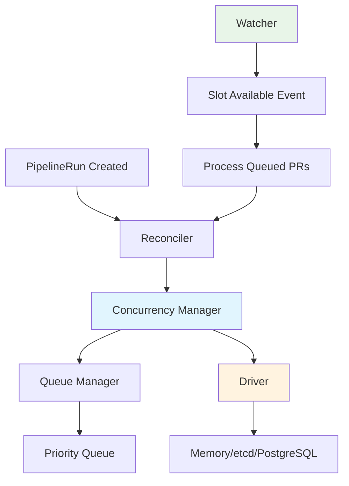
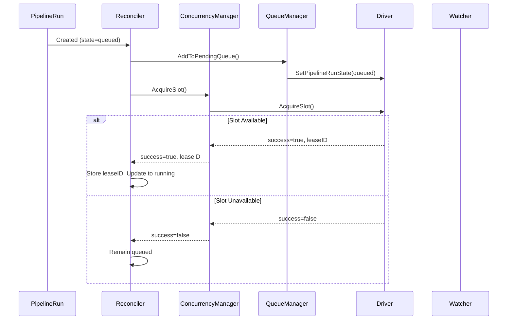
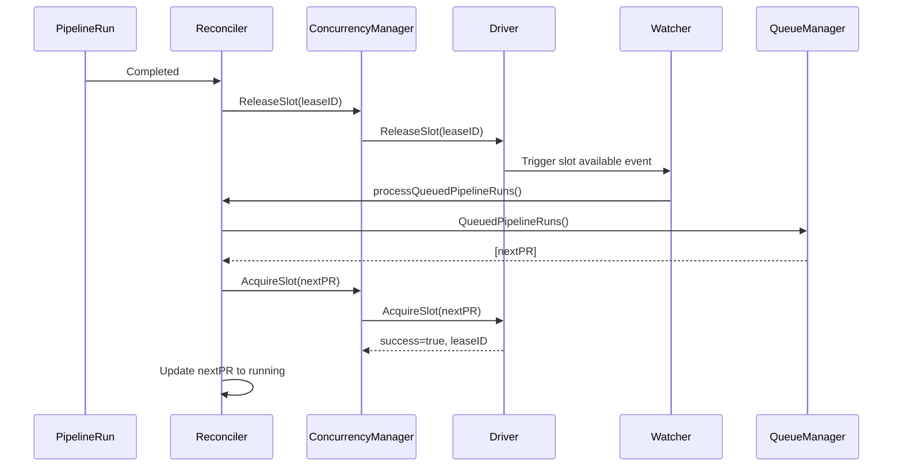
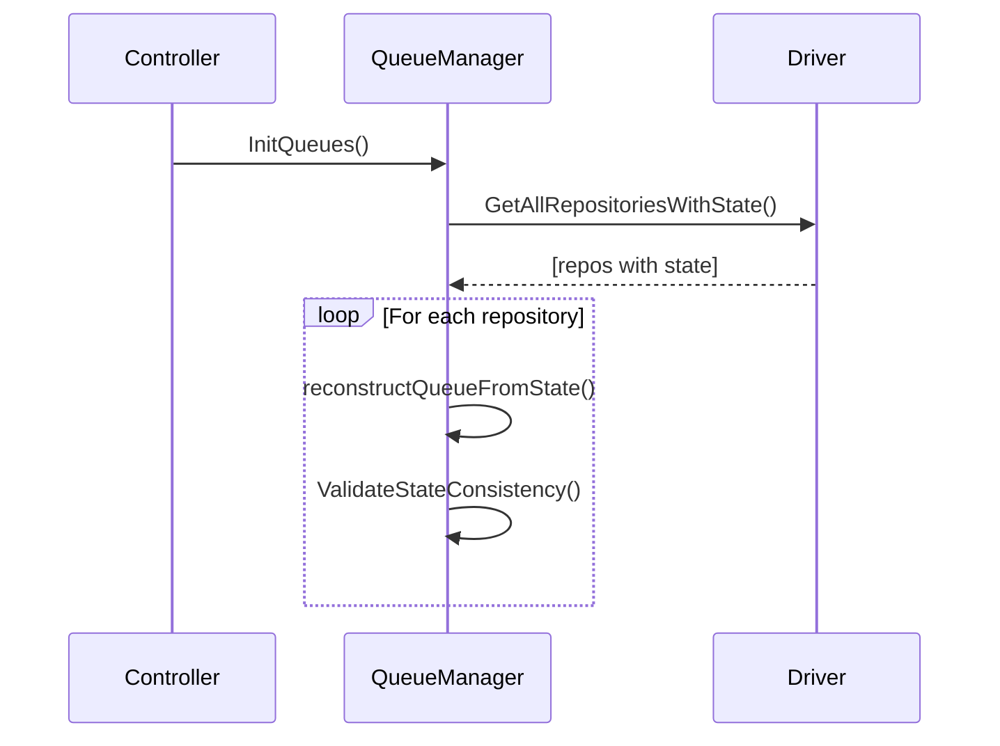

# Concurrency Control System

This package provides a state-based concurrency control system for Pipelines-as-Code that manages PipelineRun execution order and enforces concurrency limits across repositories. It supports multiple backend drivers (etcd, PostgreSQL, memory) and provides automatic state recovery after restarts.

## Table of Contents

- [Overview](#overview)
- [Architecture](#architecture)
- [Integration Points](#integration-points)
- [Call Flow](#call-flow)
- [State Management](#state-management)
- [Driver Implementations](#driver-implementations)
- [Configuration](#configuration)
- [Usage Examples](#usage-examples)
- [Testing](#testing)
- [Troubleshooting](#troubleshooting)

## Overview

The concurrency system replaces the legacy annotation-based approach with a robust state-based solution that:

- **Enforces FIFO ordering** of PipelineRuns within repositories
- **Manages concurrency limits** per repository
- **Persists state** across controller restarts (etcd/PostgreSQL drivers)
- **Provides event-driven processing** via watchers
- **Supports multiple backends** for different deployment scenarios

## Architecture



### Core Components

1. **Manager**: Main interface that orchestrates concurrency control
2. **QueueManager**: Manages in-memory FIFO queues per repository  
3. **Driver**: Persistent backend (memory/etcd/PostgreSQL)
4. **Watcher**: Event-driven notifications when slots become available

## Integration Points

### Controller Integration

The concurrency system integrates with the Pipelines-as-Code controller at several key points:

1. **Controller Initialization** (`pkg/reconciler/controller.go`):

   ```go
   // Initialize the concurrency system
   pacSettings := run.Info.GetPacOpts()
   settingsMap := settings.ConvertPacStructToConfigMap(&pacSettings.Settings)
   concurrencyManager, err := concurrency.CreateManagerFromSettings(settingsMap, run.Clients.Log)
   if err != nil {
       log.Fatalf("Failed to initialize concurrency system: %v", err)
   }
   
   // Set up reconciler with concurrency support
   r := &Reconciler{
       concurrencyManager: concurrencyManager,
       activeLeases:       make(map[string]concurrency.LeaseID),
   }
   
   // Initialize queues and set up watchers
   if err := concurrencyManager.GetQueueManager().InitQueues(ctx, run.Clients.Tekton, run.Clients.PipelineAsCode); err != nil {
       log.Fatal("failed to init queues", err)
   }
   ```

2. **PipelineRun Processing** (`pkg/reconciler/reconciler.go`):

   ```go
   // For queued PipelineRuns
   if state == kubeinteraction.StateQueued && pr.Spec.Status == tektonv1.PipelineRunSpecStatusPending {
       return r.queuePipelineRun(ctx, logger, pr)
   }
   
   // For completed PipelineRuns  
   if pr.IsDone() || pr.IsCancelled() {
       return r.reportFinalStatus(ctx, logger, &pacInfo, event, pr, detectedProvider)
   }
   ```

3. **Finalizer Integration** (`pkg/reconciler/finalizer.go`):

   ```go
   // Release slots when PipelineRuns are deleted
   prKey := fmt.Sprintf("%s/%s", pr.Namespace, pr.Name)
   repoKey := fmt.Sprintf("%s/%s", repo.Namespace, repo.Name)
   
   // Get the lease ID for proper release
   r.leaseMutex.RLock()
   leaseID, hasLease := r.activeLeases[prKey]
   r.leaseMutex.RUnlock()
   
   if err := r.concurrencyManager.ReleaseSlot(ctx, leaseID, prKey, repoKey); err != nil {
       logger.Warnf("failed to release concurrency slot for %s: %v", prKey, err)
   }
   ```

4. **Watcher Setup** (`pkg/reconciler/controller.go`):

   ```go
   // Set up watchers for all repositories to enable event-driven processing
   go func() {
       driver := concurrencyManager.GetDriver()
       repos, err := driver.GetAllRepositoriesWithState(ctx)
       if err != nil {
           log.Errorf("Failed to get repositories for watchers: %v", err)
           return
       }
   
       for _, repo := range repos {
           concurrencyManager.GetQueueManager().SetupWatcher(ctx, repo, func() {
               r.processQueuedPipelineRuns(ctx, repo)
           })
       }
   }()
   ```

## Call Flow

### PipelineRun Creation Flow



### PipelineRun Completion Flow



### State Recovery Flow



## State Management

### State Transitions

PipelineRuns progress through these states:

1. **Created** → `queued` (via reconciler)
2. **Queued** → `running` (when slot acquired)  
3. **Running** → `completed`/`failed` (when finished)

### Persistent State

The system maintains state in the chosen driver:

- **Memory Driver**: State lost on restart (testing only)
- **etcd Driver**: State persisted in etcd cluster
- **PostgreSQL Driver**: State persisted in database tables

### State Consistency

The system includes validation to detect and clean up:

- **Orphaned slots**: Running in driver but PipelineRun doesn't exist
- **Zombie PipelineRuns**: Completed but still holding slots
- **Queue mismatches**: In-memory queue doesn't match persistent state

## Driver Implementations

### Memory Driver (`memory_driver.go`)

- **Use Case**: Testing, development, single-instance deployments
- **Persistence**: None (state lost on restart)
- **Performance**: Fastest (in-memory operations)
- **Concurrency**: Thread-safe with mutexes

### etcd Driver (`etcd_driver.go`)

- **Use Case**: Production clusters, high availability
- **Persistence**: etcd cluster with strong consistency
- **Performance**: Good (network calls to etcd)
- **Features**:
  - Lease-based slot management
  - Automatic cleanup via TTL
  - Watch-based change notifications

### PostgreSQL Driver (`postgresql_driver.go`)

- **Use Case**: Existing PostgreSQL infrastructure
- **Persistence**: Database tables with ACID guarantees
- **Performance**: Good (database operations)
- **Features**:
  - Connection pooling
  - Configurable timeouts
  - Polling-based change detection

## Configuration

### Via ConfigMap

```yaml
apiVersion: v1
kind: ConfigMap
metadata:
  name: pipelines-as-code
data:
  etcd-enabled: "true"
  etcd-mode: "etcd"  # "memory", "mock", or "etcd"
  etcd-endpoints: "etcd:2379"
  etcd-dial-timeout: "5"
  
  # Optional etcd authentication
  etcd-username: "etcd_user"
  etcd-password: "etcd_password"
  
  # Optional etcd TLS
  etcd-cert-file: "/path/to/cert.pem"
  etcd-key-file: "/path/to/key.pem"
  etcd-ca-file: "/path/to/ca.pem"
```

### Via Environment Variables

```bash
export PAC_ETCD_ENABLED=true
export PAC_ETCD_MODE=etcd
export PAC_ETCD_ENDPOINTS=etcd:2379
```

### Driver Selection Logic

The system automatically selects drivers based on configuration:

```go
// CreateManagerFromSettings determines driver based on settings
func CreateManagerFromSettings(settings map[string]string, logger *zap.SugaredLogger) (*Manager, error) {
    config := &DriverConfig{}

    if IsEtcdEnabled(settings) {
        config.Driver = "etcd"
        // Configure etcd driver
    } else {
        config.Driver = "memory"
        // Configure memory driver with default TTL
    }

    return NewManager(config, logger)
}
```

## Usage Examples

### Basic Manager Usage

```go
// Create manager from settings map
settings := map[string]string{
    "etcd-enabled": "true",
    "etcd-endpoints": "localhost:2379",
}
manager, err := concurrency.CreateManagerFromSettings(settings, logger)
if err != nil {
    return fmt.Errorf("failed to create concurrency manager: %w", err)
}
defer manager.Close()

// Acquire slot for PipelineRun
success, leaseID, err := manager.AcquireSlot(ctx, repo, pipelineRunKey)
if err != nil {
    return fmt.Errorf("failed to acquire slot: %w", err)
}

if success {
    // PipelineRun can proceed
    defer manager.ReleaseSlot(ctx, leaseID, pipelineRunKey, repoKey)
    // ... process PipelineRun
}
```

### Direct Driver Configuration

```go
// Configure etcd driver directly
config := &concurrency.DriverConfig{
    Driver: "etcd",
    EtcdConfig: &concurrency.EtcdConfig{
        Endpoints:   []string{"localhost:2379"},
        DialTimeout: 5 * time.Second,
        Mode:        "etcd",
    },
}

manager, err := concurrency.NewManager(config, logger)
if err != nil {
    return fmt.Errorf("failed to create manager: %w", err)
}
defer manager.Close()
```

### Queue Management

```go
queueManager := manager.GetQueueManager()

// Add PipelineRuns to pending queue
err := queueManager.AddToPendingQueue(repo, []string{prKey1, prKey2})

// Get queued PipelineRuns
queued := queueManager.QueuedPipelineRuns(repo)

// Try to acquire slots for queued items
acquired, err := queueManager.AddListToRunningQueue(repo, queued)
```

### Watcher Setup

```go
// Set up watcher for repository
queueManager.SetupWatcher(ctx, repo, func() {
    // Called when slots become available
    processQueuedPipelineRuns(ctx, repo)
})
```

### State Recovery

```go
// Initialize queues with state recovery
err := queueManager.InitQueues(ctx, tektonClient, pacClient)

// Manual state synchronization
err := manager.SyncStateFromDriver(ctx, repo)

// Validate state consistency
err := manager.ValidateStateConsistency(ctx, repo, tektonClient)
```

## Testing

### Unit Tests

The package includes comprehensive unit tests:

```bash
# Run concurrency package tests
go test ./pkg/concurrency/...

# Run with race detection
go test -race ./pkg/concurrency/...

# Run specific test
go test -run TestCreateManagerFromSettings ./pkg/concurrency/...
```

### Integration Tests

Test the system with different drivers:

```go
// Test with memory driver
config := &DriverConfig{Driver: "memory"}
manager, err := NewManager(config, logger)

// Test with etcd driver (requires etcd instance)
config := &DriverConfig{
    Driver: "etcd",
    EtcdConfig: &EtcdConfig{Endpoints: []string{"localhost:2379"}},
}
```

### Mock Objects

Use test utilities for isolated testing:

```go
// Create mock concurrency manager for testing
mockConfig := &concurrency.DriverConfig{
    Driver: "memory",
    MemoryConfig: &concurrency.MemoryConfig{
        LeaseTTL: 30 * time.Minute,
    },
}
mockManager, err := concurrency.NewManager(mockConfig, logger)
```

## Troubleshooting

### Common Issues

1. **PipelineRuns stuck in queued state**:
   - Check concurrency limits in Repository spec
   - Verify driver connectivity (etcd/PostgreSQL)
   - Check controller logs for errors

2. **State inconsistencies after restart**:
   - Ensure persistent driver is configured correctly
   - Check that InitQueues() completes successfully
   - Run ValidateStateConsistency() manually

3. **Performance issues**:
   - Monitor watcher polling intervals
   - Check driver connection pool settings
   - Verify etcd/PostgreSQL performance

### Debugging

Enable debug logging:

```yaml
data:
  log-level: "debug"
```

Check manager status:

```go
// Get current slots
count, err := manager.GetCurrentSlots(ctx, repo)

// Get running PipelineRuns
running, err := manager.GetRunningPipelineRuns(ctx, repo)

// Get driver type
driverType := manager.GetDriverType()
```

### Recovery Procedures

#### Manual State Recovery

```go
// Sync state from driver
err := manager.SyncStateFromDriver(ctx, repo)

// Validate and clean up inconsistent state
err := manager.ValidateStateConsistency(ctx, repo, tektonClient)
```

#### Repository Cleanup

```go
// Clean up all state for a repository
err := manager.CleanupRepository(ctx, repo)
```

## Performance Considerations

### Driver Selection

- **Memory**: Fastest, but no persistence
- **etcd**: Good performance with persistence and HA
- **PostgreSQL**: Good performance with existing DB infrastructure

### Optimization Tips

1. **Tune watcher intervals** based on workload patterns
2. **Configure connection pools** for PostgreSQL driver
3. **Use etcd lease TTL** appropriate for your environment
4. **Monitor queue sizes** to detect bottlenecks

### Scaling

The system scales horizontally:

- **Multiple controller instances** can share the same persistent driver
- **Per-repository queues** allow independent scaling
- **Event-driven processing** reduces polling overhead

## Interface Reference

### Core Interfaces

```go
// Manager provides unified interface for concurrency control
type Manager interface {
    AcquireSlot(ctx context.Context, repo *v1alpha1.Repository, pipelineRunKey string) (bool, LeaseID, error)
    ReleaseSlot(ctx context.Context, leaseID LeaseID, pipelineRunKey, repoKey string) error
    GetCurrentSlots(ctx context.Context, repo *v1alpha1.Repository) (int, error)
    GetQueueManager() QueueManager
    GetDriver() Driver
    Close() error
}

// Driver defines backend storage interface
type Driver interface {
    AcquireSlot(ctx context.Context, repo *v1alpha1.Repository, pipelineRunKey string) (bool, LeaseID, error)
    ReleaseSlot(ctx context.Context, leaseID LeaseID, pipelineRunKey, repoKey string) error
    GetCurrentSlots(ctx context.Context, repo *v1alpha1.Repository) (int, error)
    WatchSlotAvailability(ctx context.Context, repo *v1alpha1.Repository, callback func())
    GetAllRepositoriesWithState(ctx context.Context) ([]*v1alpha1.Repository, error)
    Close() error
}

// QueueManager manages in-memory queues
type QueueManager interface {
    InitQueues(ctx context.Context, tektonClient, pacClient interface{}) error
    QueuedPipelineRuns(repo *v1alpha1.Repository) []string
    AddToPendingQueue(repo *v1alpha1.Repository, list []string) error
    SetupWatcher(ctx context.Context, repo *v1alpha1.Repository, callback func())
    ValidateStateConsistency(ctx context.Context, repo *v1alpha1.Repository, tektonClient interface{}) error
}
```

---

For more detailed information, see the individual driver implementations and integration examples in the test files.
